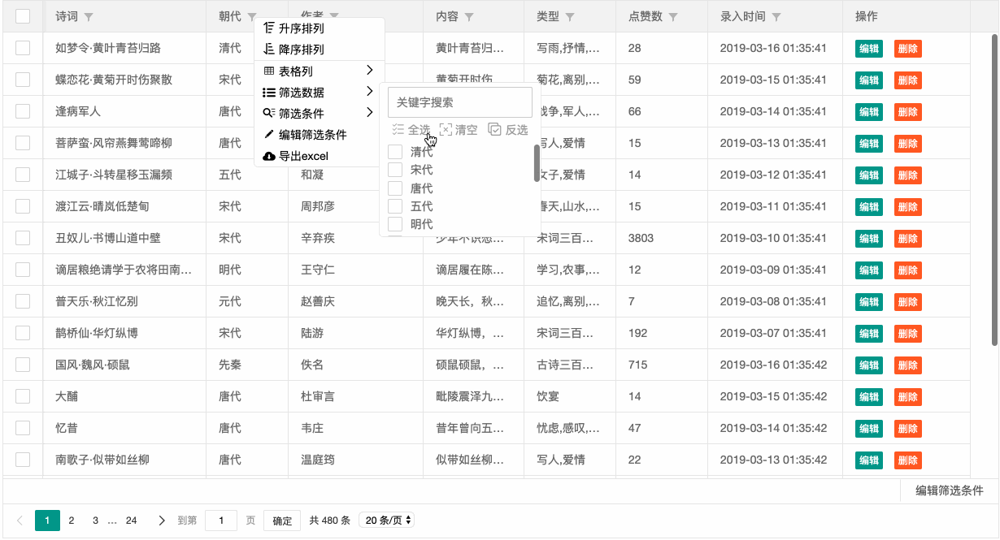
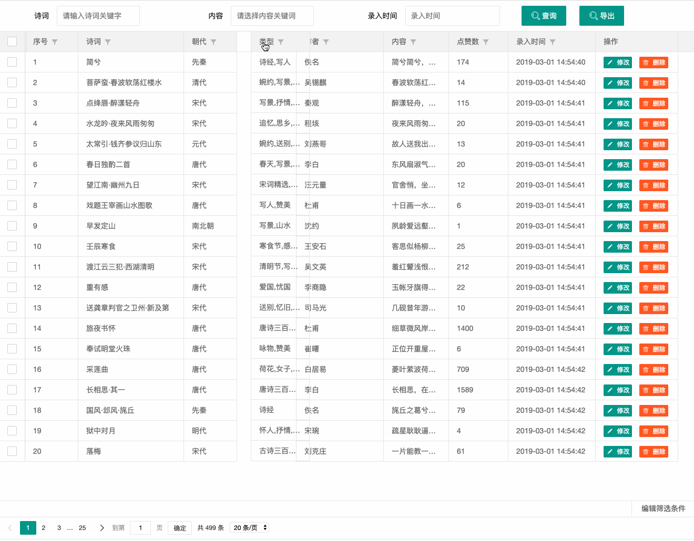
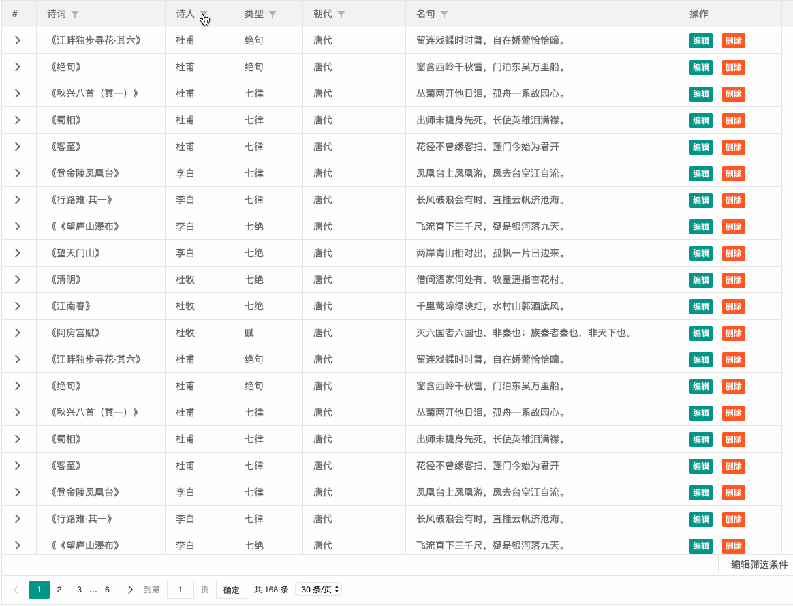

## 给 layui-table 注入点灵魂
当前layui版本 `v2.4.5` 
在线demo： [http://47.98.40.63:8088/](http://47.98.40.63:8088/)

## 扩展功能
1. 表头筛选、自定义条件（支持前端筛选、后台筛选介绍请看 <a href='#user-content-三后台筛选'>三、后台筛选</a>）
2. 拖动列调整顺序、隐藏显示列
3. excel导出（根据筛选条件和列顺序导出）
4. 子表（表中表、无限层级、子表同样支持前3个功能）

## 效果
### 1.表头筛选效果

### 2.编辑筛选效果
筛选`明代姓张的 或 唐代姓李的`的诗词

### 3.拖动列调整顺序、隐藏显示列
左右拖动调整顺序，鼠标移出表格后松开--快速隐藏列


### 4.子表


## 快速上手
1.将下面模块放到自己项目中:
>soulTable.js     总入口  
  tableFilter.js  表头筛选   
  tableChild.js   子表    
  excel.js        excel导出    
  FileSaver.js    excel导出   
  xlsx.js         excel导出   

2.定义入口模块`soulTable`  
```js
// 自定义模块，这里只需要开放soulTable即可
layui.config({
    base: 'ext/',   // 模块目录
}).extend({                         
    soulTable: 'soulTable'  // 模块别名
});
```
3.引入 `soulTable.css` 和 `animate.min.css` 到自己项目中。

4.在 `table.render()` 中使用。   
①`done` 中加入  `soulTable.render(this)`   
②在需要下拉筛选的列中加入 `filter: true` 即可生效  
```js
table.render({
    elem: '#myTable'
    ,height: $(document).height() - $('#myTable').offset().top - 20
    ,limit: 20
    ,page: true
    ,cols: [[
        {type: 'checkbox', fixed: 'left'}
        ,{field:'poetry', title:'诗词', width:188, filter:true, sort: true}
        ,{field:'name',  title:'诗人', width:100, filter:true, sort: true}
        ,{field:'type', title:'类型', width:100, filter:true}
        ,{field:'dynasty', title:'朝代',  width:150, filter:true}
        ,{field:'sentences', title:'名句', width:400, filter:true}
        ,{title:'操作', toolbar: '#barDemo', width:150}
    ]]
    ,done: function () {
        soulTable.render(this)
    }
});
```
## 详细介绍
### 一、支持使用的几种情况
[demo](http://img.soultable.xiangzhangshugongyi.com) 中都有示例
1. 前端不分页
即 `page:false` 

>注意：layui框架有个bug，可以给 `limit` 极限值，如 `limit:1000000` 来兼容这个bug  
如果不想这么干想要直接修改 `table.js` 修复这个问题，可以私信我

2. 前端分页
即 `url`为空，`page: true`

3. 后台分页
即 `url: xxxxx`, `page: true`

>由于前两种筛选都是在前端完成,所以可以直接使用，但是 `后台分页`的情况下，前台数据是不完整，所以需要后台支持
java 的 mybatis 拦截器我已经做了，支持 mysql、oracle 数据库。所以如果你后台是 java， 且使用了mybatis作为持久层框架，那么恭喜你可以移步[这里](https://github.com/yelog/layui-soul-table-java)来集成。
其他语言或框架，暂时没有需求，欢迎进行扩展（有问题欢迎交流）。


### 二、筛选相关
<table><thead><tr><th>参数</th><th>类型</th><th colspan=4>说明</th></tr></thead><tbody><tr><td rowspan="2">filter</td><td>boolean</td><td colspan="3">true</td><td rowspan=2>默认值：false</td></tr><tr><td>object</td><td>type</td><td>date[yyyy-mm-dd hh:mm:ss]</td><td>目前做了时间类型优化（可以筛选昨天、本周、本月等） ，中括号内的格式要按照实际的数据格式进行调整。其他类型有好的想法可以进行交流扩展</td></tr></tbody></table>

1.时间类型增强, `filter: {type: 'date[yyyy-MM-dd HH:mm:ss]'}` ,格式根据具体的显示格式
```js
var myTable = table.render({
    ... 
    ,cols: [[
        ...
        ,{field: 'createTime', title: '录入时间', width: 165, filter: {type: 'date[yyyy-MM-dd HH:mm:ss]'}, sort:true}
        ... 
    ]]
    ,done: function () {
        soulTable.render(this)
    }
});
```
2.调整下拉菜单的顺序、显示（去掉下面数组的某一项即可隐藏）
此 `filter` 参数非必须，缺省即为下面所示内容
```js
var myTable = table.render({
    ... 
    cols: [[
       ... 
    ]]
    , filter: {
        //用于控制表头下拉显示，可以控制顺序、显示, 依次是：表格列、筛选数据、筛选条件、编辑筛选条件、导出excel
        items:['column','data','condition','editCondition','excel'] 
    }
    , done: function (res, curr, count) {
        soulTable.render(this)
    }
});
```
3.隐藏底部筛选区域，默认为 `true` (显示)

```js
var myTable = table.render({
    ... 
    cols: [[
       ... 
    ]]
    , filter: {
        bottom: false
    }
    , done: function (res, curr, count) {
        soulTable.render(this)
    }
});
```


### 三、后台筛选

目前支持 `java` 且使用了 `mybatis` 框架。
如果符合上面的条件，则可以移步到包含后端的完整项目即介绍：[https://github.com/yelog/layui-soul-table-java](https://github.com/yelog/layui-soul-table-java)
### 四、导出excel相关
1.配置默认样式  
<table><thead><tr><th colspan=2>参数</th><th>类型</th><th>说明</th><th>示例</th></tr></thead><tbody><tr><td colspan="2">on</td><td>boolean</td><td>表头下拉中开启excel导出功能（默认：true）</td><td>true</td></tr><tr><td colspan="2">filename</td><td>string/function</td><td>导出excel文件名（默认：表格数据.xlsx）,支持后缀：xlsx/xls&lt;br&gt; 也可传入方法,带上当天日期：<code>function(){return '诗词'+util.todatestring(new date(), 'yyyymmdd')+'xlsx'}</code></td><td>'诗词.xlsx'</td></tr><tr><td rowspan="4">head</td><td>family</td><td>string</td><td>表头字体（默认：calibri）</td><td>'helvetica'</td></tr><tr><td>size</td><td>number</td><td>表头字号（默认：12）</td><td>15</td></tr><tr><td>color</td><td>string</td><td>表头颜色（默认：'000000'） 注意：这里只能用hex（十六进制颜色码），且不能加 `#` 如红色：'ff0000'</td><td>'ff0000'</td></tr><tr><td>bgcolor</td><td>string</td><td>表头背景色（默认：'c7c7c7'）注意事项参考 head-&gt;color</td><td>'c7c7c7'</td></tr><tr><td rowspan="4">font</td><td>family</td><td>string</td><td>表头字体（默认：calibri）</td><td>'helvetica'</td></tr><tr><td>size</td><td>number</td><td>表头字号（默认：12）</td><td>15</td></tr><tr><td>color</td><td>string</td><td>表头颜色（默认：'000000'） 注意事项参考 head-&gt;color</td><td>'ff0000'</td></tr><tr><td>bgcolor</td><td>string</td><td>表头背景色（默认：'ffffff'）注意事项参考 head-&gt;color</td><td>'c7c7c7'</td></tr><tr><td colspan=2>cellType</td><td>String</td><td>单元格格式 `b` 布尔值, `n` 数字, `e` 错误, `s` 字符, `d` 日期</td><td></td>'s'</tr></tbody></table>

### 五、子表

#### 1⃣️ 开启配置

> 配置在主标 `cols` 中，这一列为展开、隐藏的入口，可以放在任意一列

| 参数 | 类型 | 说明 | 示例值 |
|:-|:-|:-|:-|
| show | Number | 展开类型(默认值: 1)<br>1: 子表在表内展开展示 <br>2: 子表以弹窗方式展示 | 1 |
| children | Array | 子表参数定义，数组的一个元素代表一个子表 | 可参考layui-table的api |

#### 2⃣️ 子表参数

| 参数     | 类型            | 说明                                                         | 示例值                                                       |
| -------- | --------------- | ------------------------------------------------------------ | ------------------------------------------------------------ |
| title    | String          | 子表标题                                                     |                                                              |
| where    | Object/Function | 子表请求参数<br>1: 赋值json数据<br>2: 方法返回json数据，参数为当前行数据 | 1. where: {name:'小明'}<br>2. where: function(d){ <br>  console.log(d); <br>  return {name: d.name}<br>} |
| data     | Array/Function  | 子表数据<br>1: 赋值子表格数据<br>2: 方法返回表格数据，参数为当前行数据 | 1. data: []<br/>2. Data: function(d){ <br>  console.log(d); <br>  return []<br>} |
| toolEvent | Function  | 子表行事件绑定（`table.on('tool(filter)',function(){})`）<br> **注意：子表的事件名（如`edit`）不能与主表相同，否则会同时触发主表事件** | toolEvent: function(d){ <br>  var layEvent = obj.event; //获得 lay-event 对应的值<br>  var tr = obj.tr; //获得当前行 tr 的DOM对象 <br>  if(layEvent === 'edit'){}<br>} |
| 其他参数 | -               | 与layui 的 table 一致，[官方文档](<https://www.layui.com/doc/modules/table.html>) | **注意： 子表的没有 elem 参数**                              |

#### 3⃣️ 示例

```js
var myTable = table.render({
    elem: '#myTable'
    ,height: $(document).height() - $('#myTable').offset().top - 20
    ,limit: 30
    ,page: true
    ,cols: [[
        {title: '#', width: 50, children:[
                {
                    title: '表格一'
                    ,url: 'data.json'
                    ,height: 300
                    ,limit: 10000000
                    ,page: false
                    ,toolEvent: function (obj) {
                        if (obj.event === 'childEdit') {
                            layer.open({
                                type: 1,
                                title: '子表1-编辑',
                                shadeClose: true,
                                content:obj.data
                            });
                        } else if (obj.event === 'childDel') {
                            layer.open({
                                type: 1,
                                title: '子表1-删除',
                                shadeClose: true,
                                content: obj.data
                            });
                        }
                    }
                    ,cols: [[
                        {type: 'checkbox', fixed: 'left'},
                        {field: 'title', title: '诗词', width: 200, sort: true, filter: true},
                        {field: 'dynasty', title: '朝代', width: 100, sort: true, filter: true},
                        {field: 'author', title: '作者', width: 165 , filter: true},
                        {field: 'content', title: '内容', width: 123, filter: true},
                        {field: 'type', title: '类型', width: 112,  filter: {split:','}, sort:true},
                        {field: 'heat', title: '点赞数', width: 112,  filter: true, sort:true},
                        {field: 'createTime', title: '录入时间', width: 165, filter: {type: 'date[yyyy-MM-dd HH:mm:ss]'}, sort:true},
                        {title: '操作', width: 156, templet: '#childBar'}
                    ]]
                    ,done: function () {
                        layui.soulTable.render(this);
                    }
                },
                {
                    title: '表格二'
                    ,height: 300
                    ,limit: 1000000
                    ,data: function (d) {
                        // d 为当前行数据
                        console.log(d);
                        return [d];
                    }
                    ,toolEvent: function (obj) {
                        if (obj.event === 'childEdit') {
                            layer.open({
                                type: 1,
                                title: '子表2-编辑',
                                shadeClose: true,
                                content:obj.data
                            });
                        } else if (obj.event === 'childDel') {
                            layer.open({
                                type: 1,
                                title: '子表2-删除',
                                shadeClose: true,
                                content:obj.data
                            });
                        }

                    }
                    ,page: false
                    ,cols: [[
                        {type: 'checkbox', fixed: 'left'},
                        {field: 'title', title: '诗词', width: 200, sort: true, filter: true},
                        {field: 'dynasty', title: '朝代', width: 100, sort: true, filter: true},
                        {field: 'author', title: '作者', width: 165 , filter: true},
                        {field: 'content', title: '内容', width: 123, filter: true},
                        {field: 'type', title: '类型', width: 112,  filter: {split:','}, sort:true},
                        {field: 'heat', title: '点赞数', width: 112,  filter: true, sort:true},
                        {field: 'createTime', title: '录入时间', width: 165, filter: {type: 'date[yyyy-MM-dd HH:mm:ss]'}, sort:true},
                        {title: '操作', width: 156, templet: '#childBar'}
                    ]]
                    ,done: function () {
                        layui.soulTable.render(this);
                    }
                }
            ]},
        {field: 'title', title: '诗词', width: 200, sort: true, filter: true},
        {field: 'dynasty', title: '朝代', width: 100, sort: true, filter: true},
        {field: 'author', title: '作者', width: 165 , filter: true},
        {field: 'content', title: '内容', width: 123, filter: true},
        {field: 'type', title: '类型', width: 112,  filter: {split:','}, sort:true},
        {field: 'heat', title: '点赞数', width: 112,  filter: true, sort:true},
        {field: 'createTime', title: '录入时间', width: 165, filter: {type: 'date[yyyy-MM-dd HH:mm:ss]'}, sort:true},
        {title: '操作', width: 156, templet: '#bar'}
    ]]
    ,done: function () {
        soulTable.render(this)
    }
});
```

>下面为默认配置，如果不改，可直接去掉excel参数

```js
var myTable = table.render({
    ...
    , cols: [[
        ...
    ]]
    , excel:{ // 导出excel配置, （以下值均为默认值）
        on: true, //是否启用, 默认开启
        filename: '诗词.xlsx', // 文件名
        head:{ // 表头样式
            family: 'Calibri', // 字体
            size: 12, // 字号
            color: '000000', // 字体颜色
            bgColor: 'C7C7C7' // 背景颜色
        },
        font: { // 正文样式
            family: 'Calibri', // 字体
            size: 12, // 字号
            color: '000000', // 字体颜色
            bgColor: 'FFFFFF' //背景颜色
        }
    }
    , done: function (res, curr, count) {
        soulTable.render(this)
    }
});
```
## 内置方法
### 1.渲染入口render()
`soulTable.render(this)` 使用在 table.render() 的 done 内，如果需要使用此插件中的任何功能都需要有这句话。

### 2.excel导出export()
除了开启下拉列表中的`excel导出`外，还可以自己调用方法进行导出。
```html
<a class="layui-btn" id="export">导出</a>
<script>
    layui.use(['form', 'soulTable', 'table'], function () {
        ...
        var myTable = table.render({
            ... 
            , done: function (res, curr, count) {
                soulTable.render(this)
            }
        });
        
        $('#export').on('click', function() {
            soulTable.export(myTable);
        })
    })
</script>
```


## 依赖项目
| 开源项目名称 | 地址 | 用于 |
|:-|:-|:-|
| layui | https://github.com/sentsin/layui | 土壤框架 |
| layui-excel | https://github.com/wangerzi/layui-excel | excel文件导出 |

## 最后
当然具体的可以clone下来代码查看，有问题可以在 issue 区提问，我会尽可能快的回复。
